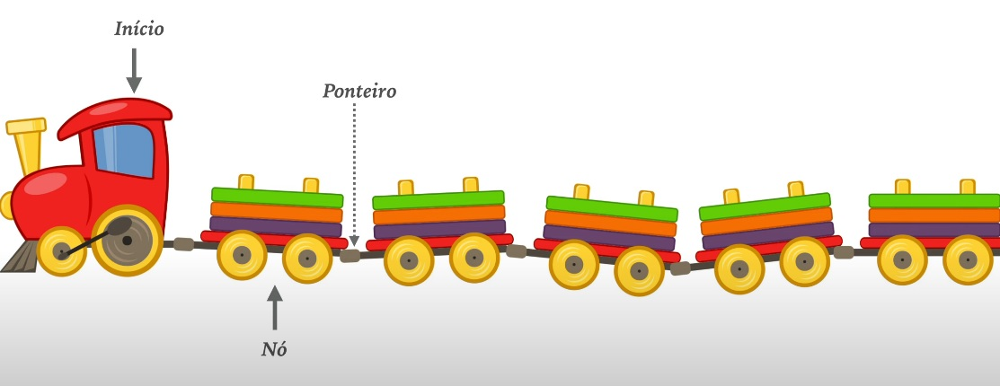

# LISTA ENCADEADA - COMPLETO



* Criar a lista; [ Trem ]
````java
public class ListaEncadeada<T>{ // <T> -> p/ saber+ procure sobre os tipos genéricos do java.
    private No<T> inicio;
}
````
* Criar o Nó; [ Vagão ]
    * Gerar os métodos Getters & Setters;
    * Gerar / Criar Constructors;

````java
public class No<T> { // <T> -> p/ saber+ procure sobre os tipos genéricos do java.
    private T elemento;
    private No<T> proximo;
}
````
* Constructor de Nó;

> 1x construtor normal e outro caso já saibamos quem é o proximo elemento.
````java
    public No(T elemento) {
        this.elemento = elemento;
        this.proximo = null;
    }
    public No(T elemento, No<T> proximo) {
        this.elemento = elemento;
        this.proximo = proximo;
    }

````
* Reescrever toString; [ESTE NÃO É O toSTRING FINAL]
> p/ facilitar a visualização iremos tbm reescrever/gerar o método toString [tanto no Nó quanto na ListaEncadeada]

````java
    @Override // Nó <-
    public String toString() {
        return "No [elemento=" + elemento + ", proximo=" + proximo + "]";
    }
````
````java
    @Override // ListaEncadeada <-
    public String toString() {
        return "ListaEncadeada [inicio=" + inicio + "]";
    }
````

## Adicionar Elementos na lista encadeada:
* A Classe ListaEncadeada vai ficar assim: 
````java
public class ListaEncadeada<T>{
    private No<T> inicio;
    public void adiciona(T elemento){
        No<T> celula = new No<T>(elemento);
        this.inicio = celula;
    }
    @Override
    public String toString() {
        return "ListaEncadeada [inicio=" + inicio + "]";
    }    
}
````
* Já o "main/app.java":

````java
public class App {
    public static void main(String[] args) throws Exception {
        ListaEncadeada<Integer> lista = new ListaEncadeada<>();
        lista.adiciona(1);
        System.out.println(lista);
    }
}
````
> output:  ListaEncadeada [inicio=No [elemento=1, proximo=null]]

O código está funcionando, o inicio é o nó, o elemento retornado no output por enquanto é o ultimo elemento adicionado, já o proximo é null, pois ele está se baseando que depois do ultimo não há mais nenhum.


