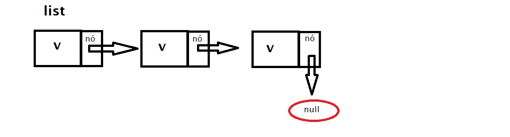
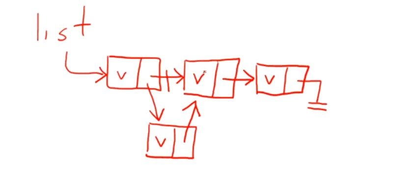

# LISTA ENCADEADA

* É UMA ESTRUTURA DE DADOS QUE ARMAZENA OS VALORES EM UMA SEQUENCIA DE "NÓS".

* CADA "NÓ" CONHECE SEU SUCESSOR (OU ANTECESSOR SE FOR UMA LISTA DUPLAMENTE ENCADEADA).

  * O NÓ É UMA UNIDADE QUE PODEMOS GUARDAR O VALOR (OU UMA REFERENCIA PARA OUTROS NÓS, DEPENDE DO TIPO DE ESTRUTURA.)
  
* TEM-SE A NOÇÃO DE POSIÇÃO NAS LISTAS(IGUAL O VETOR). (DIFERENTE DE DICIONÁRIOS E CONJUNTOS).

## CONCEITOS IMPORTANTES

* CABEÇA: PRIMEIRO ELEMENTOS DA LISTA.
* CAUDA: LISTA SEM O PRIMEIRO ELEMENTO.

## COMPLEXIDADE

* BUSCA: O(N) -> O DE (N) ELEMENTOS.
* INSERÇÃO: DEPENDE DA IMPLEMENTAÇÃO.
* REMOÇÃO: DEPENDE DA IMPLEMENTAÇÃO.

------------------------------------------------------------

Exemplo: 

Lista encadeada guarda o valor e uma referencia para o proximo:

## Vantagem:

Sendo assim caso precisar colocar um novo item "no meio", basta apontarmos o nó anterior para o novo e o nó do novo para o próximo. Sem precisar mexer em toda estrutura. Diferente do array que teria que mudar todos os elementos seguintes.

