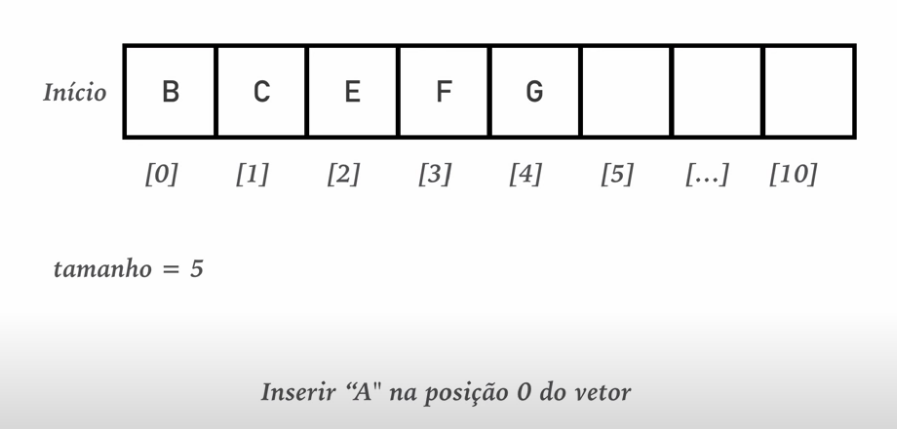
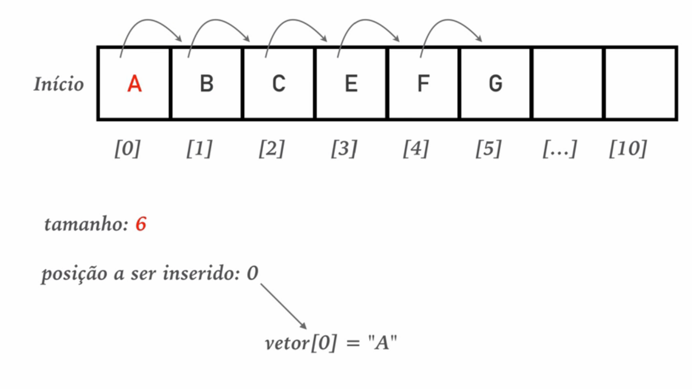

## Add elemento em qualquer posição


Não podemos **simplesmente** adicionar "A" na pos[0] visto que isso vai sobrescrever o valor que lá existe.

Precisamos mover os dados já existentes para poder dar lugar ao novo dado na posição definida.


````java
    public boolean adiciona(int pos, String elemento){
        if (!(pos >=0 && pos < tamanho )){ // verifica se [pos] é valida
            throw new IllegalArgumentException("Posição inválida!");
        }
        for (int i = this.tamanho-1; i >= pos; i--) { // obs1
            this.elementos[i+1] = this.elementos[i];
        }
        this.elementos[pos] = elemento;
        this.tamanho ++;
            return true;
            }

````

Obs1: Dessa forma só vamos iterar a partir da [pos] definida.

Exemplo, se a posição for a do meio ele vai só iterar a partir da metade, movendo os itens para as proximas posições.