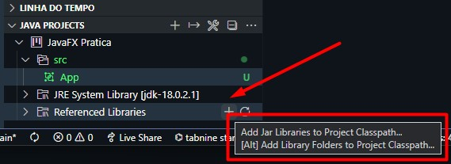
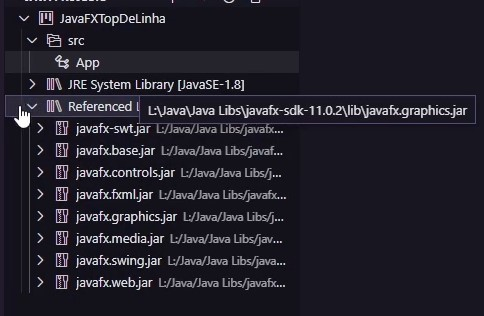

# JavaFX para iniciantes - intro


Primeiramente precisamos:

* do Java instalado;

* JavaFX instalado; -> https://gluonhq.com/products/javafx/ ou https://youtu.be/A_fF7fl2lAs

* Instalar o Scene Builder; link -> https://gluonhq.com/products/scene-builder/

    * next... next... next... next... next...
* Instalar extensão JavaFX Support no Vscode; 

No Vscode:


Crie ou abra um projeto, após isso seleciona a opção no canto esquerdo:



... e selecione todos os arquivos ".jar" dentro da pasta lib, extraídos após o download do JavaFX. Eles são suas "libs"/bibliotecas.




# Código Base:

````java
import javafx.application.Application;
import javafx.fxml.FXMLLoader;
import javafx.scene.Parent;
import javafx.scene.Scene;
import javafx.stage.Stage;

public class App extends Application {
    public static void main(String[] args) throws Exception {
        launch(args);
    }

    @Override
    public void start(Stage primaryStage) throws Exception {
        FXMLLoader layoutLoader = new FXMLLoader(getClass().getResource("layout.fxml")); // caminho do layout
        Parent root = layoutLoader.load(); // load layout do SceneBuilder
        Scene tela = new Scene(root);

        primaryStage.setTitle("Titulo da Minha Janela");
        primaryStage.setScene(tela); 
        primaryStage.show(); // mostrar janela

    }
}

````