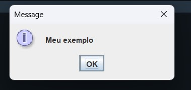
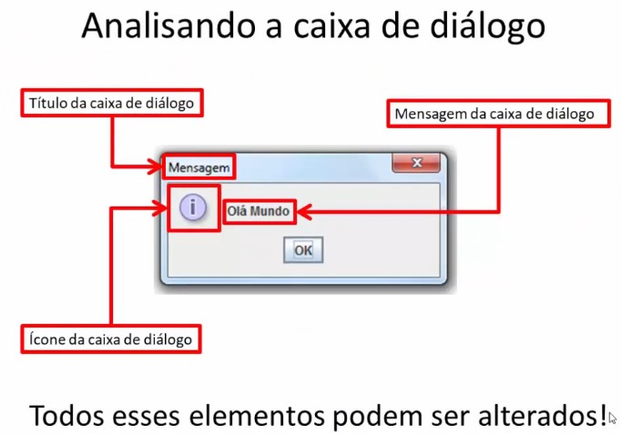
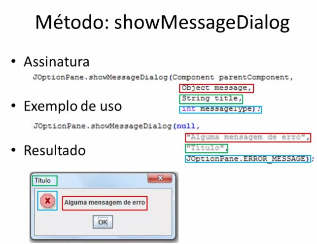
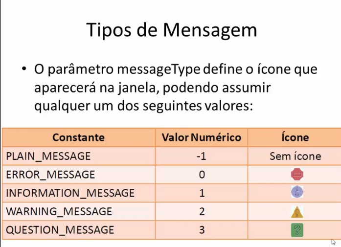

# showMessageDialog

* Função:
    - Exibir mensagens de texto;
* Exemplo/Sintaxe:
    - JoptionPane.showMessageDialog(null, "Olá Mundo");
* Resultado:


> Usamos a forma mais simples do método, só passando 2x argumentos.

O primeiro argumento neste caso foi definido como null, ele é usado para centralizar a janela de dialogo. Ou seja, caso o valor seja null ele irá considerar o monitor para centralizar. Podemos colocar no argumento que a janela vai usar como base outra janela para centralizar, assim a janela de dialogo vai centralizar a partir dessa janela passada no argumento.
O segundo argumento é a mensagem que vai aparecer na janela.

#### Os icones e titulos da janela podem ser editados e/ou personalizados.

- Exemplo:
````java
import javax.swing.JOptionPane;
public class App {
    public static void main(String[] args) throws Exception {
        JOptionPane.showMessageDialog(null, args);
    }
}
````
#### Resultado:




### Outro jeito:

````java
JOptionPane.showMessageDialog(null, "Olá mundo 2", "Mensagem de Boas vindas", JOptionPane.ERROR_MESSAGE);
````
Sintaxe resumida:
JOptionPane.showMessageDialog(posição, "Mensagem", "Titulo", constante da classe JOptionPane);

> A constante pode ser outro ou até pode ser números inteiros que representam os símbolos que irão aparecer na caixa de dialogo, porém, normalmente usamos as contantes da classe JOptionPane.


## Usando Ícones personalizados.


````java
 ImageIcon icone = new ImageIcon("ifpb.png");
JOptionPane.showMessageDialog(null, "Olá mundo 3", "Mensagem de Boas vindas", JOptionPane.INFORMATION_MESSAGE, icone);
````


Observe que mesmo o ícone sendo personalizado passamos o ícone de information_message antes, pois é assim que funciona, mesmo que ele não apareça. O personalizado vai substituir ele.


# Resumo: 






